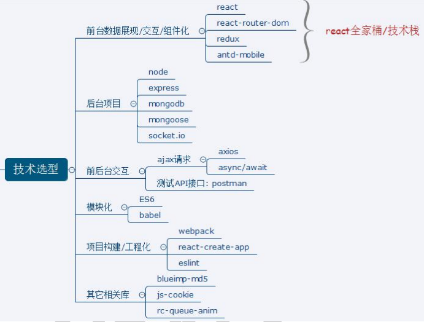
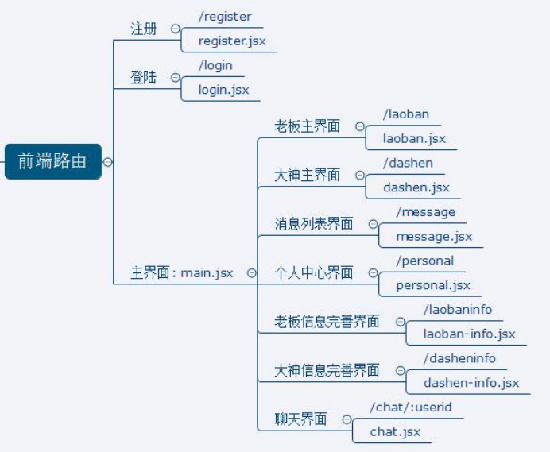

# react 关于招聘app的复习项目及笔记
```接下来是按步骤来```
## 项目描述一下
- 此项目为一个前后台分离的招聘的 SPA, 包括前端应用和后端应用 
- 包括用户注册/登陆, 大神/老板列表, 实时聊天等模块 
- 前端: 使用 React 全家桶+ES6+Webpack 等技术 
- 后端: 使用 Node + express + mongodb + socketIO 等技术 
- 采用模块化、组件化、工程化的模式开发
## 技术选型

## 项目创建
- 先用脚手架初始化创建该项目，即为起步
`create-react-app xxx`

## Ajax封装
- 添加了一些基础图片，并用axios封装Ajax
```
    import axios from 'axios'
    
    export default function ajax(url,data={},type="GET"){
        if(type==='GET'){
            let paramStr = '';
            Object.keys(data).forEach((key)=>{
                paramStr+=key+'='+data[key]+'&'
            });
            if(paramStr){
                paramStr.substring(0,paramStr.length-1);
                url+='?'+paramStr;
            }
            return axios.get(url);
        }else {
            return axios.post(url,data)
        }
    }
```
- 此时还创建了后端，并完成了register和login两个接口的编写
 ```
    router.post('/路径',(req,res)=>{
        //req.body里面包含了前端提交的数据
        ...在这里对其前端数据进行相关处理将处理后的结果通过
        //res.send({...在这里面将处理的结果传给前端})
    })
 
 ```
## redux理解
- 完善前端register和login的相关redux部分
```
    redux包含四部分
    1.actions包含前端所需发请求的异步和同步函数工厂
    //异步
    export const xxx=(...)=>{
        return dispatch=>{
            ...//做一些处理，在这里发送Ajax请求，将后端得到的数据在这里通过dispatch分发
               //一个同步action出去并在reducers里面进行数据状态的最后处理与管理
                //每一个异步action都会对应一个同步action
            dispatch(xxxT(...(要传的数据)))
        }
    }
    //同步
    const xxxT = (...)=>({type:(标记类型),data:{...}})
    2.reduces是state状态管理工厂
    import {combineReducers} from 'redux'
    function  XXXR (state=initData,action){
        //actions里面的函数所传的数据会传送到action对象里,
        //action里面有两个重要的属性，type,data
        switch(action.type){
            case 1:
            ...
            default: 
            return state;
        }
    }
    export default combineReducers({
        XXXR //reducer最终要暴露出去的所有处理的函数的处理结果
    })
    3.store,redux的管理总部，该js文件基本保持不变
    import {createStore,applyMiddleware} from 'redux'
    import thunk    from 'redux-thunk'//实现异步
    import {composeWithDevTools} from 'redux-devtools-extension'//redux的浏览器插件使用
    import reducers from "./reducers";
    
    export default createStore(reducers,composeWithDevTools(applyMiddleware(thunk)))
    4.actions-type.js文件里面主要存储的是action里面分发reducer的type标记符号
```

## 组件开发
> 所有组件包含如下



## 项目中所学得

- 流程及开发方法 
    1) 熟悉一个项目的开发流程 
    2) 学会模块化、组件化、工程化的开发模式 
    3) 掌握使用 create-react-app 脚手架初始化 react 项目开发 
    4) 学会使用 node+express+mongoose+mongodb 搭建后台开发
- React 插件或第三方库 
    1) 学会使用 react-router-dom 开发单页应用 
    2) 学会使用 axios 与后端进行数据交互 
    3) 学会使用 redux+react-redux+redux-thunk 管理应用组件状态 
    4) 学会使用 antd-mobile 组件库构建界面 
    5) 学会使用 mongoose 操作 mongodb 数据库
    6) 学会使用 express 搭建后台路由 
    7) 学会使用 socket.io 实现实时通信 
    8) 学会使用 blueimp-md5 对密码进行 MD5 加密处理 
    9) 学会使用 js-cookies 操作浏览器端 cookie 数据
